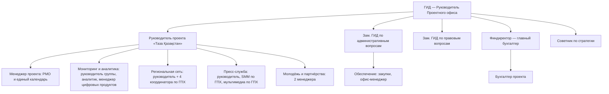

> ЧЕРНОВИК — в работе (2026-09-11). Бюджет с формулами: `D:\ТАЗА\Бюджет оператора Таза Казахстан (черновик 2026-09-11).xlsx`. Word: `D:\ТАЗА\План усиления команды Таза Казахстан (черновик 2026-09-11).docx`.

# План усиления работы ЦАКФ по проекту «Таза Қазақстан»

## 1. Коротко

- **База.** По структуре Фонда 7 штатных единиц: ГИД, 2 заместителя ГИД, заместитель руководителя ПО, менеджер проектов, финансовый директор, советник. На 10.09.2026 заняты 4, вакантны 3 (зам. ГИД по правовым вопросам, зам. руководителя ПО, менеджер проектов).
- **Сколько людей нужно.** Для роли оператора (проектного офиса) «Таза Қазақстан» рекомендую **команду из 23 человек**:
  7 базовых единиц + **16 новых** (10 в штат + 6 по ГПХ). Нанять надо **19 человек**: 3 на вакансии базы и 16 на новые позиции.
  Минимальный вариант — **17 человек** (+10 новых: 7 в штат + 3 по ГПХ), нанять 13.
- **Бюджет** (подробно в разделе 6):

| | Оптимальный (23 чел.) | Минимальный (17 чел.) |
|---|---:|---:|
| Запуск: ноябрь–декабрь 2026 (без НДС) | 61,3 млн ₸ | 51,8 млн ₸ |
| 2027 год (без НДС) | **371,1 млн ₸** | **265,1 млн ₸** |
| 2027 год с НДС 16% | 430,5 млн ₸ | 307,5 млн ₸ |
| Итого за 14 месяцев (без НДС) | 432,3 млн ₸ | 316,8 млн ₸ |
| Годовой бюджет в устойчивом режиме, 2028 (без НДС) | 356,7 млн ₸ | 259,5 млн ₸ |

- **Главное условие.** Сначала соглашение с МЭПР и понятный источник денег, потом найм.
  У Фонда на 01.09.2026 касса около нуля, кредиторская задолженность ~35,5 млн ₸ (из неё налоги ~8,6 млн).
  В 2025 году уже были пени за задержку зарплат. Нанимать 19 человек без подписанного финансирования нельзя.

## 2. Исходные данные

- **Объём работы оператора:**
  - ~440 мероприятий в год: ~110 якорных и ~335 фоновых;
  - 20 регионов;
  - 60 пунктов Плана действий Концепции;
  - более 20 госорганов-исполнителей;
  - ежемесячные заседания Центра мониторинга при Премьер-министре;
  - ежеквартальный рейтинг регионов МЭПР;
  - ~49 тыс. заявок в TazaQazBot.
- **Функции оператора** — из служебной записки: координация мероприятий; единый календарь; методическая помощь соисполнителям; мониторинг, KPI и отчётность; консолидация данных; медиа; цифровые инструменты; партнёрства.
- **Оклады** — по ведомости 1С за 2025 год: ГИД 1,6 млн ₸, замы ГИД 1,4 млн, финдиректор 1,1 млн, менеджер проектов 1,2 млн (гросс).
  Новые позиции — в этой же сетке. ГПХ дешевле, с учётом нагрузки и опыта.
- **Налоги 2026** (новый Налоговый кодекс): соцналог 6%, ОПВР 3,5%, СО 5% (база до 7 МЗП), ООСМС 3%.
  Отчисления работодателя — ~12–16% к окладу, в Excel считаются по каждой позиции. **НДС — 16%.**
- **Горизонт расчёта:** ноябрь–декабрь 2026 (запуск) + 2027 год. Для 2028–2029 годов — годовая сумма в устойчивом режиме.

## 3. Новая штатная структура

| № | Группа | Должность | Форма | Оклад / гонорар в мес., ₸ | Старт | Мин. вариант |
|---|---|---|---|---:|---|:---:|
| 1 | Базовый штат | ГИД — Руководитель Проектного офиса | штат, занята | 1 600 000 | — | да |
| 2 | Базовый штат | Зам. ГИД по административным вопросам | штат, занята | 1 400 000 | — | да |
| 3 | Базовый штат | Финансовый директор — главный бухгалтер | штат, занята | 1 100 000 | — | да |
| 4 | Базовый штат | Советник по стратегии | штат, занята | 1 400 000* | — | да |
| 5 | Базовый штат | Зам. ГИД по правовым вопросам (50% — на проект) | штат, вакансия | 1 400 000 | ноя 2026 | да |
| 6 | Руководство проекта | Руководитель проекта «Таза Қазақстан» (ставка зам. руководителя ПО) | штат, вакансия | 1 400 000 | ноя 2026 | да |
| 7 | Руководство проекта | Менеджер проекта — PMO и календарь (ставка менеджера проектов) | штат, вакансия | 1 200 000 | ноя 2026 | да |
| 8 | Мониторинг | Руководитель группы мониторинга, KPI и методологии | штат, новая | 1 100 000 | ноя 2026 | да |
| 9 | Мониторинг | Аналитик данных и отчётности | штат, новая | 800 000 | ноя 2026 | да |
| 10 | Мониторинг | Менеджер цифровых продуктов | штат, новая | 900 000 | ноя 2026 | нет |
| 11 | Регионы | Руководитель региональной сети | штат, новая | 1 000 000 | ноя 2026 | да |
| 12–15 | Регионы | Региональные координаторы: Север, Юг, Восток, Запад и Центр | ГПХ, 4 чел. | 450 000 | фев 2027 | 2 из 4 |
| 16 | Пресс-служба | Руководитель пресс-службы проекта | штат, новая | 1 000 000 | ноя 2026 | да |
| 17 | Пресс-служба | SMM-менеджер / контент-редактор (KZ/RU) | ГПХ | 450 000 | ноя 2026 | да |
| 18 | Пресс-служба | Мультимедиа-дизайнер / видеограф (~60% загрузки) | ГПХ | 400 000 | фев 2027 | нет |
| 19 | Молодёжь и партнёрства | Менеджер по волонтёрам и молодёжным программам | штат, новая | 800 000 | фев 2027 | да |
| 20 | Молодёжь и партнёрства | Менеджер по партнёрствам (бизнес, НПО, международные) | штат, новая | 900 000 | фев 2027 | нет |
| 21 | Обеспечение | Бухгалтер проекта | штат, новая | 700 000 | ноя 2026 | да |
| 22 | Обеспечение | Менеджер по закупкам и договорам | штат, новая | 700 000 | ноя 2026 | нет |
| 23 | Обеспечение | Офис-менеджер / ассистент проекта | штат, новая | 500 000 | ноя 2026 | да |

\* Оклад советника — допущение (в ведомости 2025 его нет).
Оклады ГИД, зама по административным вопросам, финдиректора и советника в бюджет проекта напрямую не входят. Их долю покрывают накладные Фонда 8%.

**Региональные координаторы** работают по ГПХ и живут в своём макрорегионе. Так дешевле, чем возить людей из Астаны, и у проекта есть глаза на месте.
- Север: Акмолинская, Костанайская, СКО, Павлодарская, Астана.
- Юг: Туркестанская, Жамбылская, Кызылординская, Шымкент.
- Восток: ВКО, Абай, Жетісу, Алматинская, Алматы.
- Запад и Центр: Актюбинская, ЗКО, Атырауская, Мангистауская, Карагандинская, Ұлытау.

В минимальном варианте 2 координатора делят страну пополам.

**Минимальный вариант (17 чел.)** — без менеджера цифровых продуктов, менеджера по партнёрствам, менеджера по закупкам, мультимедиа и двух региональных координаторов. Их функции распределяются так:
- сайт — на аналитика и подрядчика;
- партнёрства — на менеджера по молодёжи и советника;
- закупки — на зама по административным вопросам;
- фото и видео — подрядчик по заявкам.

## 4. Распределение обязанностей

### Базовый штат

- **ГИД — Руководитель ПО.**
  - Отношения с МЭПР и Правительством.
  - Подписание соглашения и договоров.
  - Доклады руководству МЭПР.
  - Утверждение планов и отчётов оператора.
- **Зам. ГИД по административным вопросам.**
  - Найм и кадровые приказы.
  - Офис и оснащение.
  - Командировки.
  - Курирует закупки и обеспечение.
- **Зам. ГИД по правовым вопросам** (вакансия; 50% времени — проект).
  - Соглашение МЭПР — ЦАКФ и регламент взаимодействия.
  - Договоры: подряды, ГПХ, аренда, партнёры.
  - Соглашение об обмене данными, персональные данные.
  - Правовая экспертиза бренда.
- **Финансовый директор — главный бухгалтер.**
  - Бюджет проекта и раздельный учёт.
  - Налоги, включая НДС.
  - Финансовые отчёты заказчику или донору.
  - Контроль кассового разрыва.
- **Советник по стратегии.**
  - Экспертиза методики KPI.
  - Связка с COP31 и повесткой Центральной Азии.
  - Международные организации — вместе с менеджером по партнёрствам.

### Команда проекта

- **Руководитель проекта «Таза Қазақстан».**
  - Руководит командой.
  - Годовой и квартальные планы работ, KPI команды.
  - Ежедневная связь с МЭПР (профильный департамент, пресс-служба).
  - Материалы к заседаниям Центра мониторинга.
  - Отчёт оператора заказчику.
- **Менеджер проекта (PMO и календарь).**
  - Единый календарь мероприятий: месячный → недельный.
  - Карточки якорных мероприятий.
  - Протоколы совещаний, реестр поручений и контроль сроков.
  - Шаблоны документов.
- **Руководитель группы мониторинга, KPI и методологии.**
  - Паспорта индикаторов по 60 пунктам Плана.
  - Единая форма отчётности для акиматов и госорганов: справочник единиц, сроки.
  - Ежемесячный свод для Центра мониторинга.
  - Сопровождение рейтинга регионов.
  - Методическая помощь исполнителям.
- **Аналитик данных и отчётности.**
  - Сбор и проверка отчётов 20 регионов.
  - База данных проекта.
  - Дашборды (Power BI).
  - Анализ заявок TazaQazBot: категории, сроки, отстающие регионы.
- **Менеджер цифровых продуктов.**
  - ТЗ и приёмка сайта-витрины и дашборда у подрядчика.
  - Telegram-канал проекта (техническая часть).
  - Интеграция с ботом и eGov — через МЭПР.
  - Связь с МКИ по цифровому паспорту волонтёра.
- **Руководитель региональной сети.**
  - Сеть ответственных лиц в 20 акиматах.
  - Еженедельные видеозвонки.
  - Выезды в регионы.
  - Контроль исполнения календаря на местах.
  - Обучение ответственных лиц.
- **Региональные координаторы (ГПХ).**
  - Работа с акиматами своего макрорегиона: сверка планов, контроль проведения мероприятий, сбор отчётов.
  - Фото и видео с мест.
  - Истории волонтёров для медиа.
- **Руководитель пресс-службы проекта.**
  - Коммуникационная стратегия и медиаплан.
  - Пресс-релизы и работа со СМИ.
  - Согласование материалов с пресс-службами МЭПР и МКИ.
  - Гайд по использованию бренда «Таза Қазақстан».
- **SMM-менеджер / контент-редактор (ГПХ).**
  - Telegram-канал и соцсети проекта.
  - Контент-план.
  - Тексты на казахском и русском.
- **Мультимедиа-дизайнер / видеограф (ГПХ).**
  - Съёмка якорных мероприятий, монтаж.
  - Инфографика.
  - Вёрстка отчётов.
- **Менеджер по волонтёрам и молодёжным программам.**
  - Молодёжная программа (8 направлений).
  - qazvolunteer.kz и «Жасыл ел».
  - Вузы и школы (ProEco, «Зелёная школа»).
  - Green Aral.
  - UNICEF Zhastary.
- **Менеджер по партнёрствам.**
  - Привлечение бизнеса: ESG-проекты, озеленение, конкурс «Парыз».
  - НПО.
  - Международные организации: ЮНИСЕФ, ПРООН, ЮНЕП.
  - Спонсорские пакеты — вместе с направлением PR.
- **Бухгалтер проекта.**
  - Первичные документы и платежи.
  - Договоры ГПХ.
  - Авансовые отчёты по командировкам.
  - Раздельный учёт.
- **Менеджер по закупкам и договорам.**
  - План закупок.
  - Процедуры по Правилам закупок Фонда.
  - Договоры и акты.
  - Учёт основных средств и ТМЦ.
- **Офис-менеджер / ассистент проекта.**
  - Документооборот: входящие и исходящие.
  - Логистика командировок.
  - Встречи.
  - Хозяйство офиса.

### Кто за что отвечает по ключевым процессам

Обозначения: **О** — отвечает, **У** — участвует, **С** — согласует / утверждает.

| Процесс | О | У | С |
|---|---|---|---|
| Соглашение с МЭПР, отношения с заказчиком | Руководитель проекта | юрист | ГИД |
| Единый календарь (месяц → неделя) | Менеджер проекта | рег. сеть, пресс-служба | Руководитель проекта |
| Методика KPI и форма отчётности МИО | Руководитель мониторинга | аналитик, советник | Руководитель проекта, МЭПР |
| Ежемесячный свод к заседанию Центра мониторинга | Аналитик | руководитель мониторинга | Руководитель проекта, ГИД |
| Сопровождение рейтинга регионов | Руководитель мониторинга | аналитик | МЭПР |
| Работа с 20 акиматами | Руководитель рег. сети | рег. координаторы | Руководитель проекта |
| Медиа, Telegram-канал | Руководитель пресс-службы | SMM, мультимедиа | пресс-служба МЭПР |
| Сайт-витрина, дашборд | Менеджер цифровых продуктов | аналитик, закупки, юрист | Руководитель проекта |
| Молодёжная программа, волонтёры | Менеджер по молодёжи | рег. сеть, пресс-служба | Руководитель проекта |
| Партнёры: бизнес, НПО, международные | Менеджер по партнёрствам | советник | ГИД |
| Бюджет, платежи, финотчёт | Финдиректор | бухгалтер | ГИД |
| Закупки | Менеджер по закупкам | офис-менеджер | Зам. ГИД по адм. вопросам |
| Кадры, офис, командировки | Зам. ГИД по адм. вопросам | офис-менеджер | ГИД |

## 5. План усиления по этапам

| Этап | Срок | Что делаем |
|---|---|---|
| 0. Решение и деньги | сентябрь–октябрь 2026 | Согласовать модель с МЭПР (оператор при МЭПР, без госфункций). Направить служебную записку. Определить источник денег и форму: договор услуг или грант. Проект соглашения. Одобрение Верховного Попечителя / Управляющего совета: участие, структура, штатное расписание, бюджет. **Найм — только после подписания финансирования.** |
| 1. Запуск | ноябрь–декабрь 2026 | Волна 1 найма: 12 человек (руководство, мониторинг, цифровой менеджер, руководитель рег. сети, пресс-служба, SMM, обеспечение). Помещение, ноутбуки, МФУ, мебель. Методика мониторинга v1 и единая форма отчётности. Календарь на 2027 год. Сеть ответственных лиц в акиматах. Запуск Telegram-канала. Первый ежемесячный свод к заседанию Центра. Отчёт за 2026 год. |
| 2. Полный состав | январь–март 2027 | Волна 2: 7 человек (4 рег. координатора, молодёжь, партнёрства, мультимедиа). ТЗ и закупка сайта-витрины с дашбордом, запуск к 1 апреля. Молодёжная программа. Первые партнёры из бизнеса. Подготовка к сезону акций. |
| 3. Устойчивый режим | апрель–декабрь 2027 | Сезон акций (апрель–октябрь). Ежемесячные своды, квартальные рейтинги. Медиасопровождение якорных мероприятий. Итоговый отчёт за год и план на 2028 год. |

**KPI оператора (предложение):**
- у всех мероприятий календаря есть карточка и отчёт в срок;
- свод к заседанию Центра мониторинга готов за 3 рабочих дня до заседания;
- ≥ 90% регионов сдают отчёт в срок и по единой форме;
- сайт-витрина запущен до 01.04.2027;
- в Telegram-канале не меньше 20 публикаций в месяц;
- ≥ 10 партнёров из бизнеса и НПО в 2027 году;
- у каждого из 20 акиматов есть обученное ответственное лицо.

## 6. Бюджет

Расчёт — в Excel (листы «Свод», «Штат», «Командировки», «Оснащение и офис», «Параметры»). Любую ставку можно поменять на листе «Параметры».

### По статьям, млн ₸ (без НДС)

| Статья | Опт. ноя–дек 2026 | Опт. 2027 | Мин. ноя–дек 2026 | Мин. 2027 |
|---|---:|---:|---:|---:|
| 1. Оклады и гонорары ГПХ + отчисления работодателя | 23,8 | 189,6 | 20,1 | 141,2 |
| 2. Премии (новогодняя 2026; по KPI 2 оклада в год) | 3,0 | 26,4 | 2,4 | 20,9 |
| 3. ДМС и ОСНС | 0,6 | 4,1 | 0,5 | 3,1 |
| 4. Командировки | 3,0 | 36,3 | 3,0 | 25,3 |
| 5. Оснащение: ноутбуки, цветное МФУ А3, мебель, техника | 15,5 | 5,1 | 13,4 | 1,4 |
| 6. Офис: аренда, коммунальные, связь, расходники, уборка, IT | 5,2 | 25,4 | 4,2 | 20,5 |
| 7. Цифровые инструменты: ПО, сайт-витрина, дашборд | 0,5 | 20,9 | 0,3 | 11,0 |
| 8. Медиа и коммуникации | 0,6 | 12,1 | 0,3 | 4,2 |
| 9. Прочие: найм, обучение, перевод, аудит, юруслуги | 2,1 | 8,4 | 1,6 | 7,0 |
| **Прямые затраты** | **54,2** | **328,4** | **45,8** | **234,6** |
| Накладные ЦАКФ 8% | 4,3 | 26,3 | 3,7 | 18,8 |
| Резерв 5% | 2,7 | 16,4 | 2,3 | 11,7 |
| **Итого без НДС** | **61,3** | **371,1** | **51,8** | **265,1** |
| НДС 16% (если по договору услуг) | 9,8 | 59,4 | 8,3 | 42,4 |
| **Итого с НДС** | **71,1** | **430,5** | **60,1** | **307,5** |

Справочно, по желанию и сверх итога — **программные расходы**: семинары для ответственных лиц акиматов, годовой форум, слёт волонтёров, соцопрос. В оптимальном варианте ~39 млн ₸ в год, в минимальном ~11 млн ₸.

### Что заложено

- **Ноутбуки** — каждому из 19 новых работников: 17 стандартных по ~450 тыс. ₸ и 2 производительных (для аналитики и монтажа) по ~900 тыс. ₸. Плюс мониторы и периферия на 15 мест в офисе.
- **Цветное МФУ А3** — класс Kyocera TASKalfa 2554ci или аналог, с тумбой и установкой: ~2,5 млн ₸. По рынку TASKalfa 2553ci — от 1,76 млн ₸. Плюс стартовые тонеры и обслуживание 60 тыс. ₸ в месяц.
- **Помещение.** Дополнительно 140 м² в оптимальном варианте (15 рабочих мест по ~8 м² и переговорная), 110 м² в минимальном. Класс B в Астане, 7 000 ₸ за м² в месяц + 15% на коммунальные: ~1,13 млн ₸ в месяц. Плюс возвратный депозит за 1 месяц.
  **Сначала проверить**, сколько мест в текущем офисе (каб. 702–704), и попросить помещение у МЭПР или «Жасыл Даму».
- **Командировки.**
  - Поездка по РК на 3 дня: авиабилет 90 тыс. ₸, гостиница 2 ночи по 30 тыс. ₸, суточные 6 МРП в день, местный транспорт. Итого ~243 тыс. ₸.
  - Однодневный выезд координатора по своему макрорегиону: ~41 тыс. ₸.
  - Загранпоездка на 5 дней: ~1,22 млн ₸.
  - В оптимальном варианте за год: 104 поездки по РК, 16 выездов в месяц у 4 региональных координаторов, 4 загранпоездки.
- **Офис и команда:**
  - корпоративная связь, интернет;
  - Microsoft 365, Power BI, Zoom, дизайн-ПО, лицензии 1С;
  - канцелярия, уборка, IT-аутсорс, такси, представительские;
  - ДМС (300 тыс. ₸ на сотрудника в год, как в бюджете Фонда);
  - ОСНС (тариф 0,29%);
  - подбор через hh.kz;
  - обучение (150 тыс. ₸ на человека в год);
  - перевод на казахский и английский;
  - аудит проекта (если его потребует источник денег).
- **Цифровые инструменты.** Сайт-витрина «Таза Қазақстан» с дашбордом и интеграцией с TazaQazBot — подряд за 15 млн ₸ в оптимальном варианте, 7 млн ₸ в минимальном. Поддержка и хостинг — 350 тыс. ₸ в месяц.
- **Премии.** Новогодняя 2026 — 250 тыс. ₸ (как в практике Фонда). В 2027 году — по KPI, по 1 окладу за каждое полугодие. Все премии — только с согласия Верховного Попечителя.

### Как снизить бюджет оптимального варианта (оценка на 2027 год)

| Мера | Экономия, млн ₸ |
|---|---:|
| Помещение от МЭПР или «Жасыл Даму» без арендной платы | −13,5 |
| Премии 1 оклад в год вместо 2 | −13,2 |
| Региональные координаторы только в сезон акций (апрель–октябрь) | −10 |
| Командировки −30% (часть встреч — по видеосвязи) | −10,9 |
| Сайт в минимальной версии (7 млн вместо 15) | −8 |
| Гонорары ГПХ ниже: координаторы и SMM по 350 тыс., мультимедиа 300 тыс. | −6,7 |
| Без видеопродакшна, таргет 200 тыс. в месяц | −6,4 |
| **Всего** | **≈ −69** (2027 ≈ 300 млн ₸ без НДС) |

## 7. Документы для запуска

**А. С МЭПР и заказчиком**
1. Соглашение (меморандум) МЭПР — ЦАКФ о функциях оператора (проектного офиса) «Таза Қазақстан»: функции, ограничения (без госфункций), сроки, порядок отчётности.
2. Распорядительный документ о статусе оператора: приказ МЭПР или решение (протокол) Центра мониторинга.
3. Регламент взаимодействия МЭПР — оператор — акиматы и госорганы: кто что делает, сроки, форматы.
4. Договор финансирования (услуги или грант) с техническим заданием, сметой и графиком платежей; условие об авансе.
5. Соглашение об обмене данными: доступ к TazaQazBot и отчётам МИО, конфиденциальность, персональные данные.
6. Письмо МЭПР в акиматы о назначении ответственных лиц и порядке работы с оператором.
7. Разрешение на использование бренда «Таза Қазақстан» и бренд-гайд.

**Б. Внутри ЦАКФ**
8. Представление и согласование Верховного Попечителя / решение Управляющего совета: участие в проекте, структура, штатное расписание, бюджет.
9. Приказ ГИД о создании Проектного офиса «Таза Қазақстан» (подразделения) и Положение о нём.
10. Новая организационная структура и штатное расписание.
11. Должностные инструкции на 19 позиций; для ГПХ — технические задания к договорам.
12. Изменения в бюджет Фонда на 2026 год, бюджет 2027 года, смета проекта.
13. Изменения в План закупок и закупочные процедуры: ноутбуки, МФУ, мебель, аренда, сайт, медиа.
14. Положение об оплате труда и премировании по KPI.
15. Положение о командировках: нормы суточных и проживания по РК и за рубежом.
16. Трудовые договоры (срочные, на срок финансирования), приказы о приёме, NDA. Для перепрофилированных ставок — изменения к должностям.
17. Дополнительное соглашение к договору ОСНС с BCC Life — включить новых работников.
18. Договор аренды и акт приёма-передачи помещения; договор на обслуживание МФУ.
19. IT и безопасность: политика информационной безопасности, учёт техники, акты выдачи ноутбуков, резервное копирование.
20. Инструкции по охране труда и пожарной безопасности, журналы инструктажей.

**В. Проектные документы оператора**
21. Паспорт (устав) проекта: цели, KPI, этапы, риски, матрица ответственности.
22. Операционный план на ноябрь 2026 — декабрь 2027.
23. Методика мониторинга: паспорта индикаторов по 60 пунктам Плана, единая форма отчётности МИО, справочник единиц, график сдачи.
24. Регламент единого календаря (месяц → неделя) и шаблон карточки мероприятия.
25. Шаблоны ежемесячного свода для Центра мониторинга, квартального и годового отчёта.
26. Коммуникационная стратегия и медиаплан; правила Telegram-канала.
27. ТЗ на сайт-витрину, дашборд и интеграцию с ботом.
28. Концепция молодёжной программы («Молодёжная климатическая повестка», 8 направлений).
29. Стратегия партнёрств и спонсорские пакеты.
30. Реестр рисков.

## 8. Что ещё учесть (возможно, забыли)

- **Кассовый разрыв.** Зарплату платим каждый месяц, а заказчик часто платит по актам в конце этапа. В оптимальном варианте проект стоит ~31 млн ₸ в месяц, из них ~18 млн — зарплаты и премии. Нужен аванс минимум на 2–3 месяца расходов (~60–90 млн ₸) или помесячная оплата.
- **Налоговый долг Фонда** (~8,6 млн ₸) может помешать договору с госорганом или квазигосом. Закрыть до подписания.
- **НДС.** При договоре услуг сумма вырастает на 16%. При гранте или спонсорстве НДС нет. Отдельно: в смете COP31 взят НДС 12%, а с 2026 года ставка 16%. Проверить с финдиректором — разница по COP31 ~3 млн ₸.
- **Пересечение ролей** с Центром мониторинга при Премьере и Проектным офисом по региональной политике. Чётко записать в соглашении, что ЦАКФ — оператор при МЭПР.
- **Сезонность.** Пик — апрель–октябрь. Отпуска команды — с ноября по март. Часть ГПХ можно нанимать на сезон.
- **Ноябрь 2026 совпадает с COP31.** Команда COP31 работает до декабря. Людей на запуск «Таза Қазақстан» брать отдельно, не снимать с COP31.
- **Бренд и контент.** Бренд «Таза Қазақстан» — государственный, нужно согласование. Контент — обязательно на казахском.
- **Данные.** Без соглашения с МЭПР нет доступа к данным TazaQazBot и отчётам акиматов, а значит нет аналитики.
- **Премии и загранкомандировки ГИД** — только с согласия Верховного Попечителя (порядок Фонда).
- **Закупки.** Разработка сайта за 15 млн ₸, аренда, техника — по Правилам закупок Фонда. Учесть сроки процедур: 1–2 месяца.
- **Учёт и защита техники.** Акты выдачи, материальная ответственность, резервное копирование, у удалённых координаторов — шифрование дисков.

## 9. Вопросы к Мурату

1. База «7 штатных» — это 7 единиц по структуре (4 занято + 3 вакансии)? Я считал так.
2. Кто платит (бюджет МЭПР, «Жасыл Даму», спонсоры, доноры) и в какой форме (договор услуг с НДС или грант)?
3. Когда реально стартуем? Я взял найм с 01.11.2026 и вторую волну с 01.02.2027.
4. Оклады и гонорары ГПХ — подходят? Где снизить?
5. Премии — 2 оклада в год нормально или 1?
6. Помещение: хватит ли текущего офиса, или арендуем / просим у МЭПР?
7. Горизонт — до 2029 года (срок Концепции)?
8. Вариант: оптимальный или минимальный, или что-то между?
