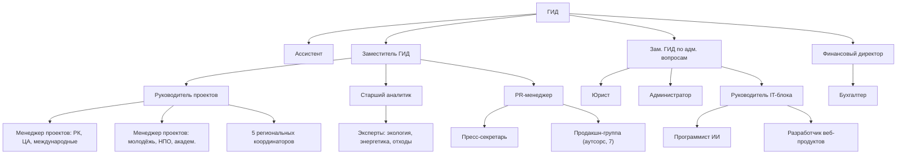

> ЧЕРНОВИК — в работе (2026-09-12). Word: `D:\ТАЗА\Функционал сотрудников ЦАКФ по Таза Казахстан (черновик 2026-09-12).docx`.

# Функционал сотрудников ЦАКФ по проекту «Таза Қазақстан»

Основа — кадровая схема Мурата от 12.09.2026 ([[04 — Кадровая схема (проект Мурата, 2026-09-12)]]): штат 25 человек и продакшн-группа 7 человек (аутсорс).
Направления работы — из файла `D:\ТАЗА\Предложения Таза Казахстан.docx` и служебной записки:

1. **Координация** работы по «Таза Қазақстан» в регионах.
2. **Идеология «Жасыл Қазақстан»** — новая ментальность по принципу «Чисто не там, где убирают, а там, где не мусорят».
3. **Информационное сопровождение** инициативы Главы государства.
4. Опора для трёх направлений: **мониторинг и аналитика**, **цифровые продукты**, **партнёрства**.

## Схема подчинения

## 1. Руководство

### Главный исполнительный директор (ГИД)
Подчиняется: Верховному Попечителю / Управляющему совету Фонда.
- Общее руководство проектным офисом «Таза Қазақстан».
- Отношения с МЭПР, Центром по мониторингу при Премьер-министре, Правительством.
- Подписание соглашения МЭПР — ЦАКФ, договоров финансирования и партнёрских соглашений.
- Утверждение годового и квартальных планов, отчётов оператора, бюджета проекта.
- Доклады руководству МЭПР; выступления на заседаниях и форумах.
- Главный спикер проекта для СМИ.

Результат: соглашение с МЭПР подписано; планы и отчёты сданы в срок; проект профинансирован.

### Ассистент ГИД
Подчиняется: ГИД.
- График ГИД, встречи, поездки.
- Входящая и исходящая корреспонденция руководителя, регистрация, контроль сроков ответов.
- Протоколы совещаний у ГИД, реестр поручений и контроль исполнения.
- Подготовка материалов к встречам и заседаниям.

Результат: ни одного пропущенного срока по поручениям ГИД.

### Заместитель ГИД
Подчиняется: ГИД. Руководит: руководителем проектов, старшим аналитиком, PR-менеджером.
- Руководит содержательной работой: проекты и регионы, аналитика, PR.
- Ежедневная связь с профильными департаментами МЭПР и пресс-службой.
- Отвечает за идеологию «Жасыл Қазақстан»: смыслы, ключевые сообщения, формат проектов.
- Утверждает единый календарь, медиаплан, аналитические материалы.
- Материалы к ежемесячным заседаниям Центра по мониторингу.
- Отчёт оператора заказчику — содержательная часть.

Результат: календарь, свод и медиаплан готовы в срок; KPI оператора выполнены.

### Заместитель ГИД по административным вопросам
Подчиняется: ГИД. Руководит: юристом, администратором, руководителем IT-блока.
- Кадры: найм 22 новых сотрудников, кадровые приказы, должностные инструкции.
- Закупки по Правилам закупок Фонда: техника, мебель, фото-видео, аренда, ремонт, услуги.
- Офис: аренда, ремонт, оснащение, охрана труда и пожарная безопасность.
- Командировки: порядок, согласование, отчёты.
- Договор с продакшн-группой (ТОО), договоры аренды и обслуживания.
- Документооборот Фонда по проекту.

Результат: команда набрана и оснащена; закупки проведены без нарушений.

## 2. Финансы

### Финансовый директор
Подчиняется: ГИД. Руководит: бухгалтером.
- Бюджет проекта, кассовый план, график платежей.
- Раздельный учёт средств проекта.
- Налоги, включая НДС 16% по аутсорсу.
- Финансовые отчёты заказчику или донору.
- Контроль исполнения сметы по статьям.

Результат: платежи и зарплата без задержек; финотчёт принят заказчиком.

### Бухгалтер
Подчиняется: финансовому директору.
- Первичные документы, платежи, банк.
- Зарплата, налоги и отчисления, ДМС и ОСНС.
- Авансовые отчёты по командировкам.
- Акты и счета продакшн-группы и поставщиков.
- Учёт основных средств и ТМЦ: ноутбуки, фото-видеотехника, мебель.

Результат: учёт без ошибок; отчётность в срок.

## 3. Проекты и регионы

### Руководитель проектов
Подчиняется: заместителю ГИД. Руководит: 2 менеджерами проектов и 5 региональными координаторами.
- Единый календарь мероприятий (~440 в год, из них ~110 общенациональных): месячный → недельный.
- Карточка на каждое якорное мероприятие: дата, место, охват, ответственные, медиа.
- Организация мероприятий ЦАКФ: форумы, круглые столы, акции, флешмобы.
- Сеть ответственных лиц в 20 акиматах; еженедельные созвоны.
- Руководит работой региональных координаторов, распределяет задачи.
- Контроль исполнения календаря на местах и отчётов после мероприятий.

Результат: у каждого мероприятия календаря есть карточка и отчёт в срок.

### Менеджер проектов (РК, Центральная Азия, международные)
Подчиняется: руководителю проектов.
- Республиканские акции с участием ЦАКФ: «Марш парков», «Всемирный день посадки», World Clean-up Day, ликвидация свалок, «Жизнь без пластика».
- Центральная Азия: Green Aral (волонтёры стран ЦА), «Зелёный щит Центральной Азии (2026–2035)», Региональный экологический саммит.
- Международные организации: ЮНИСЕФ, ПРООН, ЮНЕП; экспозиция «Таза Қазақстан» на COP31.
- Бизнес-партнёры: ESG-проекты, озеленение, конкурс «Парыз», спонсорские пакеты.

Результат: не меньше 10 партнёров из бизнеса и международных организаций в 2027 году.

### Менеджер проектов (молодёжь, НПО, академическое сообщество)
Подчиняется: руководителю проектов.
- Молодёжная программа — 8 направлений «Молодёжной климатической повестки».
- Волонтёры: qazvolunteer.kz, «Жасыл ел», волонтёрские штабы; цифровой паспорт волонтёра (с МКИ).
- Школы и колледжи: ProEco, экоуроки, «Зелёная школа» (с МП РК и МИО).
- Вузы: Zero Waste Campus, Green Energy Challenge и другие пункты Плана Концепции (с МНВО).
- НПО и экоактивисты; UNICEF Zhastary.

Результат: молодёжная программа утверждена; вузы отчитываются по своим пунктам Плана.

### Региональные координаторы (5)
Подчиняются: руководителю проектов. Живут и работают в своём макрорегионе.
1. Север — Акмолинская, Костанайская, СКО, Павлодарская.
2. Юг — Туркестанская, Жамбылская, Кызылординская области, г. Шымкент.
3. Восток — ВКО, Абай, Жетісу, Алматинская области, г. Алматы.
4. Запад — Актюбинская, ЗКО, Атырауская, Мангистауская.
5. Центр — Карагандинская, Ұлытау, г. Астана.

Функции:
- Ежедневная связь с ответственными лицами акиматов своего макрорегиона.
- Сверка региональных планов с единым календарём.
- Выезды на мероприятия, контроль проведения.
- Сбор отчётов акиматов по единой форме, проверка до отправки в свод.
- Фото и видео с мест, истории волонтёров и жителей для медиа.
- Сигналы о проблемах: стихийные свалки, невыполненные заявки TazaQazBot.

Результат: 100% мероприятий макрорегиона с отчётом; ≥ 90% отчётов в срок и по форме.

## 4. Аналитика и экспертиза

### Старший аналитик
Подчиняется: заместителю ГИД. Руководит: 3 экспертами.
- Паспорта индикаторов по 60 пунктам Плана действий Концепции.
- Единая форма отчётности для акиматов и госорганов: справочник единиц, сроки сдачи.
- Ежемесячный свод к заседанию Центра по мониторингу.
- Сопровождение ежеквартального рейтинга регионов МЭПР (5 показателей).
- Анализ заявок TazaQazBot: темы, сроки исполнения, отстающие регионы.
- Аналитические записки и годовой отчёт; постановка задач для дашборда (с IT-блоком).

Результат: свод готов за 3 рабочих дня до заседания; данные сходятся с официальными итогами.

### Эксперт по экологии
Подчиняется: старшему аналитику.
- Экспертиза мероприятий по биоразнообразию, ООПТ, водоёмам, озеленению («Марш парков», «Мөлдір бұлақ», посадка деревьев, зарыбление).
- Индикаторы экологического образования и просвещения.
- Методические материалы для акиматов, школ, волонтёров.
- Содержание видеопроекта «Жасыл Қазақстан»: нацпарки, заповедники, экотуризм.
- Спикер для СМИ по экологии.

### Эксперт по энергетике
Подчиняется: старшему аналитику.
- Энергосбережение, ВИЭ, «зелёные» технологии в мероприятиях проекта.
- Вузовские и молодёжные проекты по энергетике (Green Energy Challenge и др.), хакатоны.
- Связь с климатической повесткой: COP31, Центральная Азия.
- Экспертиза проектов бизнеса и партнёров.
- Материалы для населения по экономии энергии и ресурсов.

### Эксперт по отходам
Подчиняется: старшему аналитику.
- Индикатор Концепции — доля переработки коммунальных отходов: 29% в 2026 году → 38% в 2029 году.
- Показатели рейтинга регионов по отходам: охват вывозом ТБО, переработка, полигоны.
- Ликвидация стихийных свалок, «Жизнь без пластика», раздельный сбор, Zero Waste.
- Работа с «Жасыл Даму», переработчиками, бизнесом.
- Анализ заявок TazaQazBot по свалкам и мусору (с программистом ИИ).

Результат экспертов: заключения и материалы в срок; экспертная база для свода и медиа.

## 5. PR и медиа

### PR-менеджер
Подчиняется: заместителю ГИД. Руководит: пресс-секретарём и продакшн-группой.
- Коммуникационная стратегия и медиаплан; идеология «Жасыл Қазақстан» в контенте.
- Руководство продакшн-группой: задания, график съёмок, приёмка материалов.
- Видеопроекты «Таза Қазақстан news» и «Жасыл Қазақстан».
- Соцсети проекта (7 площадок), таргет: 10 продвигаемых публикаций в месяц.
- Согласование материалов с пресс-службами МЭПР и МКИ; бренд-гайд «Таза Қазақстан».
- Отчёт по охватам и KPI.

Результат: медиаплан выполнен; охваты — не ниже базового сценария (2–3 тыс. просмотров на публикацию).

### Пресс-секретарь
Подчиняется: PR-менеджеру.
- Работа со СМИ: пресс-релизы, анонсы, аккредитация, пресс-подходы.
- Подготовка спикеров: ГИД, эксперты, партнёры.
- Размещение роликов на республиканских телеканалах и в СМИ.
- Мониторинг СМИ, ответы на запросы журналистов.
- Тексты на казахском и русском языках.

Результат: пресс-релиз по каждому якорному мероприятию; рост упоминаний проекта в СМИ.

### Продакшн-группа (аутсорс, ТОО) — 7 человек
Подчиняется: PR-менеджеру (по договору и техническому заданию).
- **Журналисты (3)** — сбор информации, сюжеты из регионов («журналист в кадре»), тексты KZ/RU, видеоролики.
- **SMM-специалист** — 7 соцсетей (Telegram, Instagram, Facebook, Threads, LinkedIn, TikTok, YouTube), контент-план, таргет, статистика.
- **Видеограф** (режиссёр, оператор, видеоинженер) — съёмка, дрон, монтаж, адаптация роликов под соцсети и ТВ.
- **Дизайнер** — фирменный стиль, инфографика, вёрстка отчётов, полиграфия.
- **Фотограф** — фотосъёмка якорных мероприятий, фотобанк проекта.

Результат: контент по графику медиаплана; фото и видео с каждого якорного мероприятия.

## 6. Администрация и IT

### Юрист (МФЦА, закупки, кадры)
Подчиняется: заместителю ГИД по административным вопросам.
- Соглашение МЭПР — ЦАКФ, регламент взаимодействия, соглашение об обмене данными и персональных данных.
- Договоры: аренда, продакшн-группа, поставки, партнёры, спонсоры.
- Закупки по Правилам закупок Фонда: документация, протоколы, договоры.
- Кадровые документы: трудовые договоры, приказы, должностные инструкции, NDA.
- Право МФЦА; использование бренда «Таза Қазақстан»; права на фото и видео.
- Разрешения на съёмку с дрона.

Результат: все договоры и процедуры юридически чистые; претензий нет.

### Администратор
Подчиняется: заместителю ГИД по административным вопросам.
- Офис: хозяйство, уборка, ремонт, переговорная.
- Логистика командировок: билеты, гостиницы, трансфер.
- Приёмка и выдача техники, учёт фото-видеооборудования (с бухгалтером).
- Курьер, канцелярия, расходные материалы.
- Встреча гостей, организация внутренних мероприятий.

Результат: офис и командировки работают без сбоев.

### Руководитель IT-блока
Подчиняется: заместителю ГИД по административным вопросам. Руководит: программистом ИИ и разработчиком веб-продуктов.
- IT-инфраструктура офиса: сеть, Microsoft 365, NAS-архив, резервное копирование.
- Информационная безопасность и защита персональных данных.
- Цифровая стратегия проекта: сайт, дашборд, ИИ-инструменты; ТЗ и приоритеты.
- Доступ к данным TazaQazBot и eGov — через МЭПР; связь с МИИЦР.
- Поддержка пользователей.

Результат: цифровые продукты запущены в срок; инцидентов безопасности нет.

### Программист ИИ
Подчиняется: руководителю IT-блока.
- Классификация и анализ заявок TazaQazBot.
- Автоматическая проверка и свод отчётов акиматов (разные единицы, пропуски).
- ИИ-ассистент по экологии для населения и волонтёров.
- Мониторинг СМИ и соцсетей: упоминания, тональность.
- Помощь PR: черновики текстов KZ/RU, расшифровка интервью.

Результат: свод отчётов готовится быстрее; анализ заявок бота ежемесячно.

### Разработчик веб-продуктов (сайт, хранилища, Telegram-каналы)
Подчиняется: руководителю IT-блока.
- Сайт-витрина «Таза Қазақстан» (своего сайта у инициативы нет): новости, календарь, карта мероприятий.
- Дашборд с показателями (с аналитиком).
- Хранилища: фото- и видеоархив, документы.
- Telegram-канал(ы) проекта: боты, автопостинг, интеграции.
- Поддержка и развитие веб-продуктов.

Результат: сайт запущен; архив и каналы работают.

## 7. Кто за что отвечает по ключевым процессам

**О** — отвечает, **У** — участвует, **С** — согласует.

| Процесс | О | У | С |
|---|---|---|---|
| Соглашение с МЭПР, отношения с заказчиком | ГИД | заместитель ГИД, юрист | — |
| Единый календарь (месяц → неделя) | Руководитель проектов | координаторы, менеджеры, PR | Заместитель ГИД, МЭПР |
| Работа с 20 акиматами | Руководитель проектов | 5 координаторов | Заместитель ГИД |
| Методика KPI и единая форма отчётности | Старший аналитик | эксперты, IT | Заместитель ГИД, МЭПР |
| Ежемесячный свод к Центру по мониторингу | Старший аналитик | эксперты, координаторы | Заместитель ГИД, ГИД |
| Рейтинг регионов (сопровождение) | Старший аналитик | эксперт по отходам | МЭПР |
| Идеология «Жасыл Қазақстан», медиаплан | PR-менеджер | пресс-секретарь, эксперты | Заместитель ГИД, пресс-служба МЭПР |
| Видеопроекты, соцсети | PR-менеджер | продакшн-группа, координаторы | Заместитель ГИД |
| Молодёжь, волонтёры, вузы, НПО | Менеджер проектов (молодёжь) | координаторы, PR | Руководитель проектов |
| Партнёры: ЦА, международные, бизнес | Менеджер проектов (РК, ЦА, межд.) | эксперты, PR | ГИД |
| Сайт, дашборд, ИИ-инструменты | Руководитель IT-блока | аналитик, программисты | Заместитель ГИД по адм. |
| Бюджет, платежи, финотчёт | Финансовый директор | бухгалтер | ГИД |
| Закупки, договоры | Заместитель ГИД по адм. | юрист, администратор | ГИД |
| Кадры, офис, командировки | Заместитель ГИД по адм. | администратор, юрист | ГИД |
