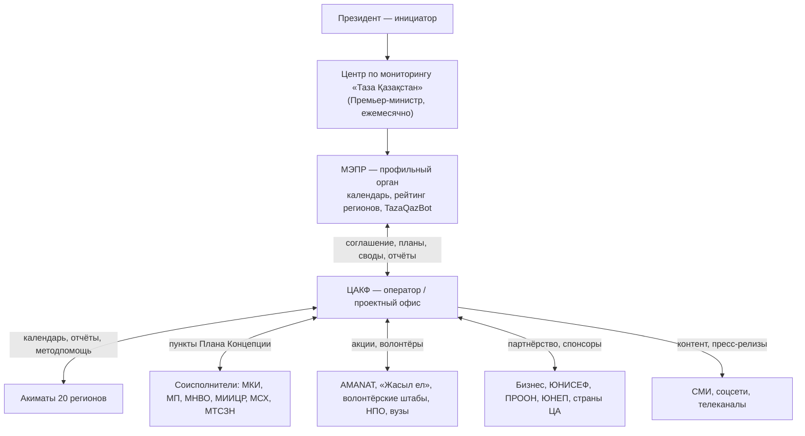

> ЧЕРНОВИК — в работе (2026-09-12). Word: `D:\ТАЗА\План и схема работы ЦАКФ по Таза Казахстан (черновик 2026-09-12).docx`, слайды: `D:\ТАЗА\Схема работы ЦАКФ по Таза Казахстан (черновик 2026-09-12).pptx`.

# План и схема работы ЦАКФ в рамках «Таза Қазақстан» (октябрь 2026 — декабрь 2027)

Источники: служебная записка о ЦАКФ-операторе; своды якорных и фоновых мероприятий 2026 (07.04.2026); отчёт за 11 мес. 2025;
«Направления с молодежью 2026»; «Предложения Таза Казахстан»; кадровая схема 12.09.2026 ([[05 — Функционал сотрудников (схема 2026-09-12)]]).
Даты мероприятий 2027 года — **ориентир по календарю 2026**; точный календарь 2027 утверждает МЭПР.

## 1. Роль ЦАКФ

ЦАКФ — **оператор (проектный офис) «Таза Қазақстан» при МЭПР**. Госфункций не берёт. Работает по соглашению с МЭПР.
Помогает МЭПР, акиматам и соисполнителям. Собирает данные. Ведёт медиа.

Три направления (из «Предложений»):
1. **Координация** работы в регионах.
2. **Идеология «Жасыл Қазақстан»** — «Чисто не там, где убирают, а там, где не мусорят».
3. **Информационное сопровождение** инициативы Главы государства.

Опора: мониторинг и аналитика, цифровые продукты, партнёрства.

## 2. Схема работы: кто с кем

### Кто в ЦАКФ с кем работает

| Блок ЦАКФ | С кем работает снаружи | Что передаёт / получает |
|---|---|---|
| ГИД | Руководство МЭПР, Центр по мониторингу, Правительство | Соглашение, доклады, годовой план и отчёт |
| Заместитель ГИД | Профильные департаменты МЭПР (ДЭКП, ДУО, КЛХЖМ и др.), пресс-служба МЭПР | Календарь, свод к заседанию, медиаплан |
| Руководитель проектов, координаторы | Ответственные лица 20 акиматов | Планы регионов, карточки мероприятий, отчёты |
| Менеджер проектов (РК, ЦА, межд.) | МКИ, акимат Кызылординской обл. (Green Aral), ЮНИСЕФ, ПРООН, ЮНЕП, бизнес, МТСЗН («Парыз») | Совместные акции, партнёрства, спонсорство |
| Менеджер проектов (молодёжь, НПО, академ.) | МП РК, МНВО, вузы, «Жасыл ел», волонтёрские штабы, qazvolunteer.kz, UNICEF Zhastary | Молодёжная программа, ProEco, вузовские пункты Плана |
| Старший аналитик, эксперты | Департаменты МЭПР, «Жасыл Даму», госорганы-исполнители Плана | Паспорта индикаторов, свод, рейтинг, записки |
| PR-менеджер, пресс-секретарь, продакшн | Пресс-службы МЭПР и МКИ, СМИ, телеканалы, блогеры | Пресс-релизы, ролики, соцсети |
| IT-блок | МЭПР (TazaQazBot), МИИЦР, eGov | Данные бота, интеграции, сайт, дашборд |
| Зам. по адм., юрист, финансы | Поставщики, арендодатель, банк, страховые, заказчик | Закупки, договоры, финотчёт |

## 3. Ритм работы (постоянный цикл)

| Как часто | Что делаем | Кто в ЦАКФ | С кем |
|---|---|---|---|
| Ежедневно | Связь с акиматами; мониторинг СМИ и TazaQazBot; публикации в соцсетях | Координаторы, пресс-секретарь, SMM, программист ИИ | Акиматы, МЭПР |
| Еженедельно | Недельный календарь; созвон с 20 акиматами; планёрка команды; анонсы в СМИ | Руководитель проектов, координаторы, PR | Ответственные лица акиматов, пресс-служба МЭПР |
| Ежемесячно | Свод к заседанию Центра по мониторингу (за 3 рабочих дня); месячный календарь; отчёт по медиа; анализ заявок бота | Старший аналитик, заместитель ГИД, PR | МЭПР, Центр по мониторингу |
| Ежеквартально | Материалы к рейтингу регионов МЭПР; квартальный отчёт оператора; план на квартал | Старший аналитик, эксперт по отходам, ГИД | МЭПР |
| Раз в полгода | Оценка KPI команды; отчёт по партнёрствам | Заместитель ГИД, финансовый директор | Заказчик |
| Ежегодно | Годовой отчёт; календарь и план на следующий год; итоговое мероприятие | ГИД, заместитель ГИД, вся команда | МЭПР, Центр по мониторингу |

## 4. План-график: октябрь — декабрь 2026 (запуск)

### Октябрь 2026 — старт

| Что | Кто в ЦАКФ | С кем |
|---|---|---|
| Согласовать модель оператора; проект соглашения МЭПР — ЦАКФ; письмо в акиматы о назначении ответственных лиц | ГИД, юрист | МЭПР |
| Решение органов Фонда: структура, штатное расписание, бюджет; приказ о проектном офисе | ГИД, зам. по адм., финдиректор | Верховный Попечитель / Управляющий совет |
| Найм (hh.kz), аренда и ремонт офиса, закупка техники и фото-видео | Зам. по адм., юрист, администратор | Поставщики, арендодатель |
| Договор с продакшн-группой (ТОО) | Зам. по адм., юрист, PR-менеджер | ТОО-подрядчик |
| Медиасопровождение: Green Aral — международная волонтёрская неделя в Приаралье; фестиваль «Фламинго-2026» (Коргалжын); слёт волонтёров «Таза Қазақстан жолында» (Петропавловск) | PR, менеджеры проектов, продакшн | Акимат Кызылординской обл., МКИ; акиматы Акмолинской обл. и СКО |
| Инвентаризация данных: отчёты 2026, рейтинг, заявки бота | Старший аналитик | МЭПР |

### Ноябрь 2026

| Что | Кто в ЦАКФ | С кем |
|---|---|---|
| Методика мониторинга v1: паспорта индикаторов, единая форма отчётности, справочник единиц | Старший аналитик, эксперты | Департаменты МЭПР |
| Сеть ответственных лиц в 20 акиматах; первый созвон | Руководитель проектов, координаторы | Акиматы |
| Республиканская акция по ликвидации стихийных свалок (20 регионов) | Эксперт по отходам, координаторы, PR | МИО, МЭПР |
| «Жизнь без пластика» (20 регионов); «Eco Patrol: Горы без вандализма» | Координаторы, PR, продакшн | МИО, МЭПР, МВД, ООПТ, НПО |
| Эко-хакатон «Clean Water Tech» (Астана/Алматы) | Руководитель IT-блока, эксперт по энергетике | МИИЦР, МЭПР |
| «Таза Қазақстан» на COP31 (Анталья, 9–20.11): ролики и материалы для павильона РК | PR, продакшн, менеджер проектов (межд.) | МЭПР, оператор павильона |
| Запуск Telegram-канала и соцсетей проекта; первые выпуски «Таза Қазақстан news» | PR-менеджер, SMM, журналисты | Пресс-служба МЭПР |
| Первый ежемесячный свод к заседанию Центра по мониторингу | Старший аналитик, заместитель ГИД | МЭПР |

### Декабрь 2026

| Что | Кто в ЦАКФ | С кем |
|---|---|---|
| Финал конкурса «Парыз», номинация «За вклад в экологию» | Менеджер проектов (РК, межд.), PR | МТСЗН, МЭПР, МИО |
| Международный день волонтёров (5.12): «Мейірімді жүрек» и др. | Менеджер проектов (молодёжь), PR | Волонтёрские штабы, акиматы |
| Акция «1000 скворечников» (Алматы, Астана) | Координаторы, PR | МЭПР, МИО |
| Итоги 2026 года: сводный отчёт, инфографика, фильм-итог | Старший аналитик, PR, продакшн | МЭПР |
| Предложения в календарь 2027; операционный план оператора на 2027 | Руководитель проектов, заместитель ГИД | МЭПР, акиматы |
| ТЗ на сайт-витрину и дашборд | Руководитель IT-блока, разработчик, аналитик | МЭПР (данные бота) |
| Молодёжная программа на 2027 (8 направлений) — проект | Менеджер проектов (молодёжь) | МКИ, МП, МНВО |

## 5. План-график на 2027 год

### I квартал (январь — март): подготовка к сезону

| Когда | Что | Кто в ЦАКФ | С кем |
|---|---|---|---|
| Январь | Годовой отчёт за 2026; утверждение операционного плана 2027 | ГИД, заместитель ГИД | МЭПР, Центр по мониторингу |
| Январь — февраль | Единый календарь 2027 (якорные + фоновые); карточки весенних мероприятий | Руководитель проектов | МЭПР, акиматы |
| Февраль | Обучение ответственных лиц акиматов (онлайн, по макрорегионам) | Руководитель проектов, старший аналитик | Акиматы |
| Февраль — март | Партнёрства на сезон: бизнес, спонсорские пакеты, ЮНИСЕФ, ПРООН | Менеджер проектов (межд.), ГИД | Бизнес, международные организации |
| Март | Запуск сайта-витрины и дашборда (до 01.04) | IT-блок | МЭПР |
| Март | Медиаплан сезона; видеопроект «Жасыл Қазақстан» — съёмки в нацпарках | PR, продакшн, эксперт по экологии | МЭПР (КЛХЖМ), нацпарки |
| Весь квартал | Своды к заседаниям Центра; рейтинг за IV кв. 2026 | Старший аналитик | МЭПР |

### II квартал (апрель — июнь): пик акций

| Когда | Что | Кто в ЦАКФ | С кем |
|---|---|---|---|
| Апрель | «Марш парков» (ООПТ); «Мөлдір бұлақ» (родники, апрель — октябрь); «Сохраним и приумножим» (школы) | Координаторы, эксперт по экологии, PR | МЭПР, МИО, МП |
| Апрель | Всемирный день посадки (~25.04), экочеллендж выпускников; «Чистые берега — чистая страна» | Все координаторы, продакшн | МИО, МП, «Жасыл ел» |
| Апрель | Региональный экологический саммит (если будет в 2027): волонтёрская панель, «Зелёный щит ЦА» | ГИД, менеджер проектов (межд.) | МЭПР, МКИ, страны ЦА |
| Май | «Таза бейсенбі» (еженедельно); «Leave No Trace KZ»; форум «Табиғатты аяла» | Менеджер проектов (молодёжь), PR | AMANAT, МП, акиматы |
| 5 июня | Всемирный день охраны окружающей среды / День эколога | ГИД, эксперты, PR | МЭПР |
| Июнь | Молодёжные экофорумы, эко-лагеря (набор) | Менеджер проектов (молодёжь) | МКИ, акиматы |
| Весь квартал | Своды, рейтинг за I кв.; полугодовой отчёт — в июле | Старший аналитик | МЭПР |

### III квартал (июль — сентябрь): лето и World Clean-up Day

| Когда | Что | Кто в ЦАКФ | С кем |
|---|---|---|---|
| Июль | Профилактика лесных пожаров; Каспийская акция «Помоги тюленям» | Координаторы (Запад, Восток), PR | МЭПР, МЧС, акиматы |
| Июль | Полугодовой отчёт оператора; оценка KPI | Заместитель ГИД, старший аналитик | МЭПР |
| Август | День Каспийского моря (12.08), Caspian Sea Action Week; эко-лагеря «Зелёное поколение»; эко-концерт «Таза Sound» | Координатор Запад, менеджер (молодёжь), PR | Акиматы Мангистауской и Атырауской обл., акимат Алматы |
| Сентябрь | World Clean-up Day (~20.09) — все регионы; конкурс ProEco | Вся команда | МЭПР, МИО, AMANAT, МП |
| Весь квартал | «Таза Қазақстан news» — сюжеты из регионов; рейтинг за II кв. | PR, продакшн, аналитик | МЭПР |

### IV квартал (октябрь — декабрь): итоги и план на 2028

| Когда | Что | Кто в ЦАКФ | С кем |
|---|---|---|---|
| Октябрь | Green Aral (волонтёры ЦА); осеннее зарыбление; слёты волонтёров | Менеджер проектов (межд.), координатор Юг | Акимат Кызылординской обл., МКИ, МЭПР |
| Ноябрь | Ликвидация стихийных свалок; «Жизнь без пластика»; хакатоны | Эксперт по отходам, IT-блок, координаторы | МИО, МЭПР, МИИЦР |
| Ноябрь | Климатическая конференция COP32 — материалы «Таза Қазақстан» (если будет участие РК) | Менеджер проектов (межд.), PR | МЭПР |
| Декабрь | «Парыз»; День волонтёров; годовой отчёт 2027; календарь и план 2028 | ГИД, заместитель ГИД, вся команда | МТСЗН, МЭПР, Центр по мониторингу |

## 6. Медиа: что выпускаем

- **«Таза Қазақстан news»** — ролики 30 сек — 1,5 мин из регионов, журналист в кадре: что сделано в рамках акции.
- **«Жасыл Қазақстан»** — ролики 1–2 мин из нацпарков и заповедников: экотуризм, бережное отношение к природе.
- Все ролики — для соцсетей и республиканских телеканалов, на казахском и русском языках.
- Соцсети: Telegram, Instagram, Facebook, Threads, LinkedIn, TikTok, YouTube.
- Продвижение: 10 публикаций в месяц (120 в год), базовый сценарий — 2–3 тыс. просмотров на публикацию.
- Фото и видео с каждого якорного мероприятия; итоговый фильм и инфографика раз в год.

## 7. Контрольные точки и KPI

| Срок | Контрольная точка |
|---|---|
| Октябрь 2026 | Соглашение МЭПР — ЦАКФ подписано; решение органов Фонда; договор с продакшн-группой |
| Ноябрь 2026 | Команда набрана; офис работает; первый свод к заседанию Центра; Telegram-канал запущен |
| Декабрь 2026 | Методика мониторинга и единая форма утверждены; итоги 2026 года; предложения в календарь 2027 |
| Март 2027 | Календарь 2027 с карточками; сайт-витрина и дашборд запущены; ответственные лица акиматов обучены |
| Июль 2027 | Полугодовой отчёт; KPI за полугодие |
| Декабрь 2027 | Годовой отчёт 2027; план и календарь 2028 |

KPI оператора:
- у каждого мероприятия календаря есть карточка и отчёт в срок;
- свод к заседанию Центра по мониторингу — за 3 рабочих дня;
- ≥ 90% регионов сдают отчёт в срок и по единой форме;
- сайт-витрина — до 01.04.2027;
- 10 продвигаемых публикаций в месяц; фото и видео с каждого якорного мероприятия;
- ≥ 10 партнёров из бизнеса, НПО и международных организаций в 2027 году;
- в каждом из 20 акиматов — обученное ответственное лицо.
